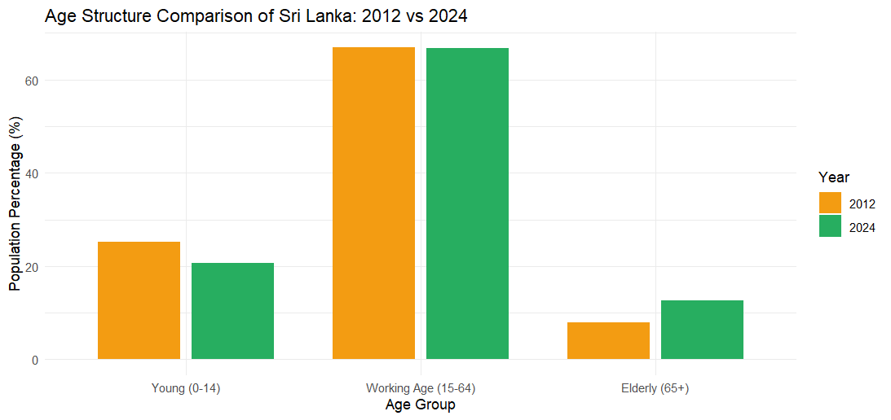
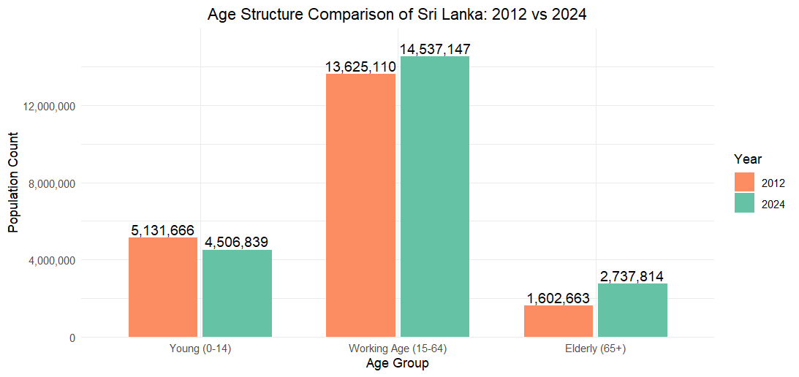
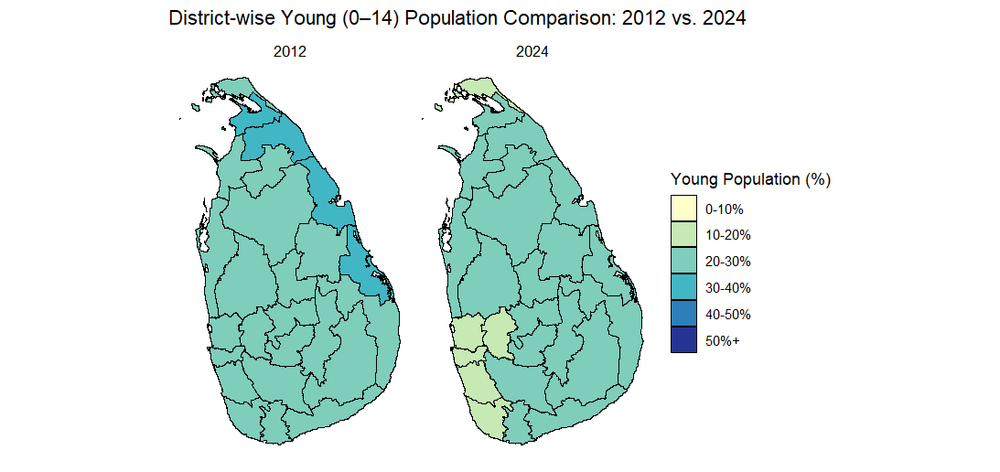
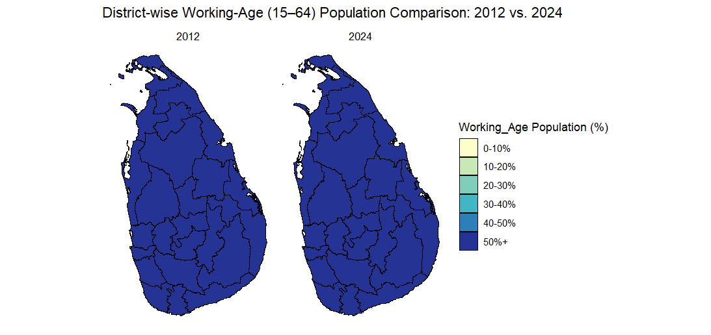
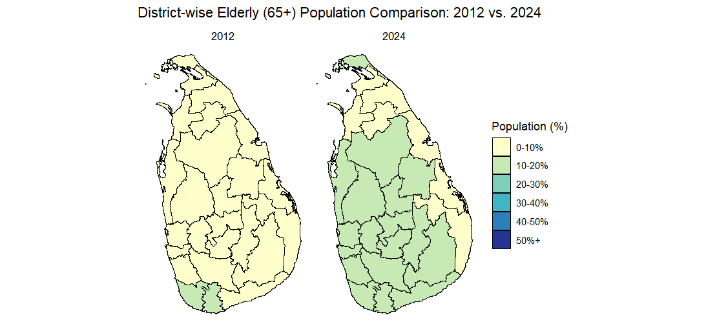

# Sri Lanka Census-Based Age Structure Analysis

# 📊 Age Structure Overview

- ## **Population Percentage Comparison (2012 vs 2024)**  
  Bar chart showing the share of Young (0–14), Working Age (15–64), and Elderly (65+) groups.  
  Key trend: decline in youth, rise in elderly population.
  
  

- ## **Population Count Comparison (2012 vs 2024)**  
  Bar chart displaying absolute counts for the same three age groups.  
  Key trend: working-age and elderly populations grew, while youth numbers fell.
  
  

---

# 🗺️ District-wise Comparisons

- ## **Young Population (0–14)**  
  Maps comparing district-level youth population percentages.  
  Key trend: northern and eastern districts had higher youth shares in 2012, but overall decline by 2024.
  
  

- ## **Working-Age Population (15–64)**  
  Maps showing district-level working-age population percentages.  
  Key trend: consistently above 50% in all districts across both years.
  
  

- ## **Elderly Population (65+)**  
  Maps comparing district-level elderly population percentages in 2012 and 2024.  
  Key trend: darker shades in 2024 highlight rising elderly proportions across districts.
  
  

---

# 📌 Purpose

These visualizations highlight Sri Lanka’s demographic transition, emphasizing both the challenges of an aging population and the opportunities that arise from shifting age structures. They provide a foundation for deeper analysis in health, economics, and social planning.

- **Health Opportunities**: With more older people in the population, there’s a chance to improve healthcare by focusing on prevention, supporting healthy lifestyles, and creating new medical tools and services that help people live longer, healthier lives. 
- **Economic Opportunities**: Because most people are in the working-age group, the country has a good chance to grow. With the right training and fair job policies, this group can boost productivity and create new businesses.  
- **Social Opportunities**: Since there are fewer children, more resources can go into improving the quality of education. At the same time, more older people means new chances for community programs, family support systems, and industries that serve seniors. 
- **Policy Innovation**: These changes in population give governments a chance to rethink pensions, jobs, and healthcare. Smart planning now can make systems stronger and more sustainable in the future.  

These plots demonstrate how clear, accessible visualizations can guide evidence-based decision-making, support academic research, and inform public awareness campaigns.

---

# 📂 Data

All data used in these visualizations was pulled directly from the **SLpopData** R package, which compiles official census data for 2012 and 2024 from the **Department of Census and Statistics, Sri Lanka**.  
The package provides structured access to population counts by five-year age group and district, enabling reproducible demographic analysis.

You can install the package directly from GitHub:
``` r
install.packages("pak")
pak::pak("amalirajapaksha/SLpopData")
```
Once installed, load the package and access the datasets:
``` r
library(SLpopData)
data(DISpop_by_FiveYearAgeGroup)
```

> ⚠️ **Note**  
> **The SLpopData package is still under development, so dataset names and functions may change as progress continues.**

---

# 🙏 Acknowledgment

It should be gratefully acknowledged that the **Department of Census and Statistics, Sri Lanka** has made census data publicly available.  
The **SLpopData** package builds directly on their official datasets from the 2012 and 2024 censuses, transforming them into tidy formats to enable user‑friendly and reproducible demographic analysis.

All Sri Lankan maps used in this project were drawn using the **Ceylon** R package developed by **Dr.Thiyanga Talagala**, which provides high‑quality spatial data and mapping tools tailored for Sri Lanka.

